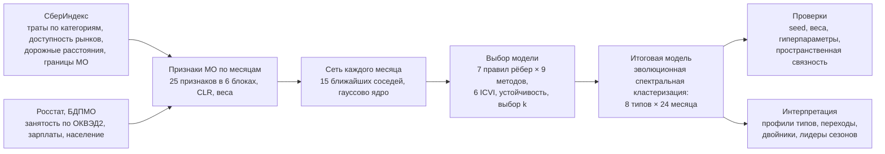

# Типы локальных экономик России: кластеризация муниципалитетов на динамической атрибутированной сети

Решение номинации «Кластеризация» онлайн-конкурса СберИндекса (2026).

**Что сделано.** Для 1815 муниципальных образований (МО) и 24 месяцев (январь 2023 — декабрь 2024)
построена динамическая атрибутированная сеть. Атрибуты МО — уровень и структура безналичных
трат жителей (СберИндекс), сезонность трат, отраслевая структура занятости и зарплаты
(БДПМО Росстата), доступность рынков и население. Каждый месяц МО связывается с 15
экономически ближайшими МО, так что сеть перестраивается вместе с экономикой.

**Результат.** 8 типов локальных экономик: столичные пригороды, удалённый Северо-Восток,
ресурсные и вахтовые центры, крупные города, города и районы Сибири, Дальнего Востока и Севера,
индустриальные малые и средние города, сельская периферия Сибири и Севера, аграрная глубинка.
Итоговая модель — эволюционная спектральная кластеризация (PCQ) на kNN-графе атрибутов.
Она выбрана из 9 методов и 7 правил построения рёбер по шести ICVI (SW, CH, S_Dbw, AVI, AVU,
MQ), стабильности во времени и устойчивости к подвыборке. 71% МО не меняют тип за два года,
91% переходов идут между соседними типами.



| Материал | Где |
|---|---|
| Интерактивный лендинг | **https://proknulo.github.io/sberindex/landing/** (локально: `python run.py serve`) |
| Презентация (PowerPoint и PDF) | [`docs/presentation.pptx`](docs/presentation.pptx), [`docs/presentation.pdf`](docs/presentation.pdf) |
| Методологический отчёт (рус.) | [`docs/report.md`](docs/report.md) |
| Соответствие критериям конкурса | [`docs/criteria.md`](docs/criteria.md) |
| Код | [`src/sbx`](src/sbx) — пакет, [`scripts`](scripts) — загрузка данных, [`run.py`](run.py) — запуск |
| Гиперпараметры | [`configs/default.yaml`](configs/default.yaml), интерпретация и тексты типов — [`configs/cluster_names.yaml`](configs/cluster_names.yaml) |
| Результаты | [`results/`](results) — таблицы сравнения, метки МО по месяцам, профили, события; рисунки — `results/figures` |

## Быстрый старт — Windows, macOS, Linux

Нужен Python ≥ 3.11. Все шаги запускаются одной командой `python run.py <шаг>` одинаково во всех ОС
(в macOS и Linux вместо `python` может понадобиться `python3`; если есть `make`, работает и `make <шаг>`).

```
python run.py setup       # виртуальное окружение .venv и зависимости
python run.py data        # данные СберИндекса, справочник МО, выгрузка БДПМО Росстата (~30 мин, кэшируется)
python run.py pipeline    # признаки → графы → сравнение методов → итоговая модель (~10 мин)
python run.py robustness  # проверки надёжности (~5 мин)
python run.py intracity   # внутригородская структура Москвы и Санкт-Петербурга
python run.py figures     # рисунки для отчёта
python run.py landing     # данные для лендинга (landing/data/data.js, landing/data/geo.js)
python run.py test        # тесты индексов качества
python run.py serve       # открыть лендинг: http://localhost:8000
python run.py all         # всё по порядку, от данных до тестов
```

Особенности платформ:

* **Windows 10/11.** Справочник МО распаковывается встроенным `tar.exe` (это bsdtar с поддержкой RAR).
  Вывод в консоль переключается на UTF-8 автоматически.
* **macOS.** Встроенный `tar` — тоже bsdtar, ничего ставить не нужно.
* **Linux.** Для распаковки RAR нужен bsdtar: `sudo apt install libarchive-tools`.
* Серверы Сбера и Росстата используют сертификаты НУЦ Минцифры. Скрипт загрузки скачивает корневые
  сертификаты и подключает их только для своих запросов, системное хранилище не меняется.

Все случайные процессы зафиксированы `seed` из конфигурации; повторный запуск даёт те же результаты.
Лендинг должен открываться через сервер (`python run.py serve`), а не двойным кликом по файлу: иначе
браузер не загрузит данные и подложку карты.

## Гиперпараметры и настройка

Все параметры модели собраны в [`configs/default.yaml`](configs/default.yaml), каждый с комментарием;
в коде их нет. Чтобы проверить другой вариант, скопируйте файл, поменяйте значения и запустите шаг
с ним: `python -m sbx pipeline --config configs/my.yaml` (или поменяйте `default.yaml` и `python run.py pipeline`).

| Раздел конфига | Что настраивает |
|---|---|
| `seed`, `paths` | зерно всех случайных процессов, папки данных и результатов |
| `data` | период, минимум наблюдённых месяцев, исключаемые типы МО, окно сглаживания, опорный месяц |
| `features` | веса шести блоков признаков, псевдосчёт CLR, соседи для импутации пропусков Росстата |
| `graph` | правило рёбер, число соседей kNN, сосед для локального масштаба σ, окна корреляций, лаг, DTW, гибрид, масштаб дорожного графа |
| `clustering` | диапазон и итоговое k, методы, итоговый метод, параметры AGC и Leiden, бутстрэп и правило устойчивости |
| `dynamics` | вес текущего месяца в эволюционной кластеризации, порог событий слияния и разделения |
| `outputs` | экономические двойники и раскладка сети для лендинга |
| `robustness` | сетка вариантов для проверок устойчивости и пространственного теста |
| `intracity` | параметры отдельного анализа районов Москвы и Санкт-Петербурга |

Названия, описания типов и тексты лендинга — в [`configs/cluster_names.yaml`](configs/cluster_names.yaml).

## Лендинг

Интерактивная страница с экономической интерпретацией и визуализацией итогов:

* **Карта** на векторной подложке OpenStreetMap: при приближении проявляются города, реки и дороги.
  Слои «Типы», «Траты», «Маркетплейсы», «Смены типа»; анимация по 24 месяцам; у каждого типа своя фишка,
  при смене типа старая фишка рушится и строится новая.
* **Районы Москвы и Петербурга** отдельным слоем: 243 внутригородские территории в пяти своих типах
  (престижный центр, срединные районы, спальные районы, районы Петербурга, периферия), карточки районов.
* **Портреты типов** и **карточки муниципалитетов** с историей типа по месяцам и пятью экономическими
  двойниками из других регионов.
* **Игра «Угадайте экономику»**: тип настоящего МО нужно определить по структуре трат и занятости.
* **Истории** изменений за два года с переходом из графика на карту.
* **Сеть экономической близости** в виде паутины с приближением: чем ближе, тем больше городов.
* **Методы**: шаги модели, сравнение правил рёбер и методов по шести ICVI, выбор k, устойчивость, профили типов.
* Скачивание типов всех МО по месяцам в CSV. Работает на телефоне.

## Структура

```
run.py                     единая точка запуска (Windows, macOS, Linux): python run.py <шаг>
configs/
  default.yaml             все гиперпараметры
  cluster_names.yaml       названия и описания типов, тексты лендинга
src/sbx/                   пакет проекта; шаги: python -m sbx <шаг>
  __main__.py              командная строка: data, pipeline, robustness, intracity, figures, landing, map, catalog
  config.py                загрузка конфига, пути относительно корня проекта
  data/                    данные
    catalog.py             категории трат и укрупнение ОКВЭД2 в 11 секторов
    loaders.py             справочник МО, траты, Росстат, дорожные расстояния
    dataset.py             сборка Dataset: всё согласовано по territory_id
    download/              скачивание: certs.py (сертификаты НУЦ), sberindex.py, rosstat.py, catalog_api.py
  features.py              пространство признаков: 25 признаков в 6 блоках, CLR, веса, импутация
  network/edges.py         7 правил построения рёбер
  clustering/
    static.py              K-means, Ward, спектральная, Leiden, AGC, темпоральный Leiden
    evolutionary.py        эволюционная кластеризация, события, метрики динамики
  evaluation/
    indices.py             ICVI: SW, CH, S_Dbw, AVI, AVU, MQ, модулярность
    robustness.py          проверки устойчивости итоговой модели
  experiments/
    context.py             общий контекст шагов: данные, признаки, кэш графов
    model_selection.py     выбор k, сравнение правил рёбер и методов
    final_model.py         итоговая модель и её выгрузки
    pipeline.py            основной сценарий: шаги по порядку
    intracity.py           районы Москвы и Санкт-Петербурга
  reporting/
    figures.py             рисунки отчёта
    geo.py                 геометрия карты лендинга
    landing.py             данные лендинга
landing/                   интерактивный лендинг
  index.html               разметка
  assets/css/style.css     стили
  assets/js/               core (общее), map, cards, game, stories, network, methods, about
  data/                    data.js и geo.js — собираются командой python run.py landing
docs/                      методологический отчёт, презентация, соответствие критериям
results/                   таблицы и рисунки
tests/                     тесты индексов качества, правил рёбер и конфига
```

## Данные и лицензии

* СберИндекс: потребительские расходы по МО, индекс доступности рынков, транспортные связи,
  справочник границ МО — CC BY-SA 4.0.
  [Описание набора](https://sberindex.ru/ru/research/data-sense-opisanie-nabora-dannikh-khakatona-sberindeksa-po-munitsipalnim-dannim),
  [справочник МО](https://sberindex.ru/ru/research/dataset-borders-and-changes-of-municipalities) (данные скачаны 30.09.2026).
* Росстат, База данных показателей муниципальных образований: среднесписочная численность работников
  по разделам ОКВЭД2, среднемесячная зарплата, численность населения, 2021–2024.
* Подложка карты: © участники OpenStreetMap, OpenFreeMap.

Код — MIT, результаты и производные данные — CC BY-SA 4.0, см. [`LICENSE`](LICENSE).
