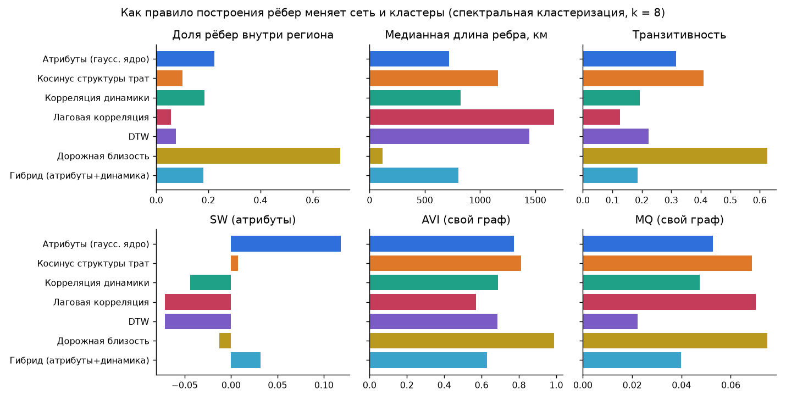
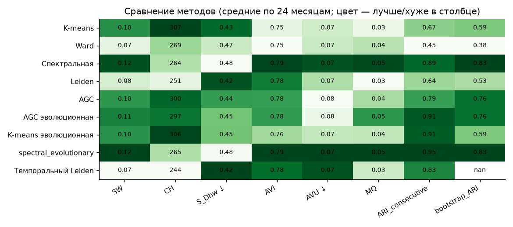
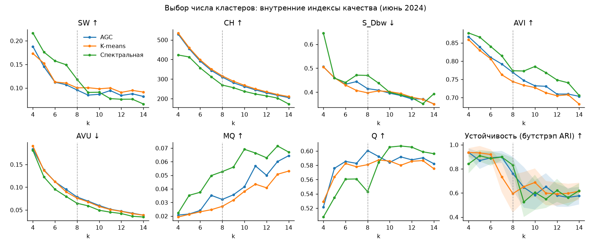
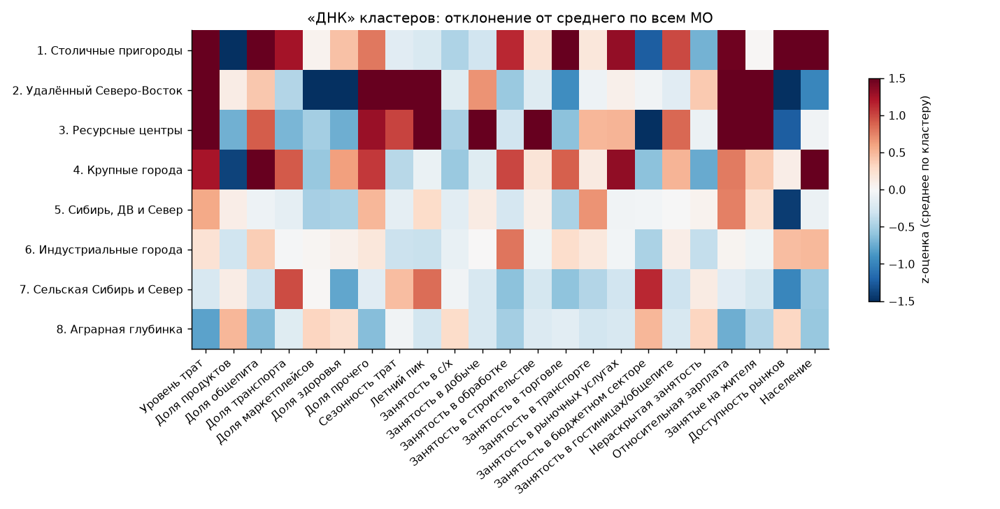
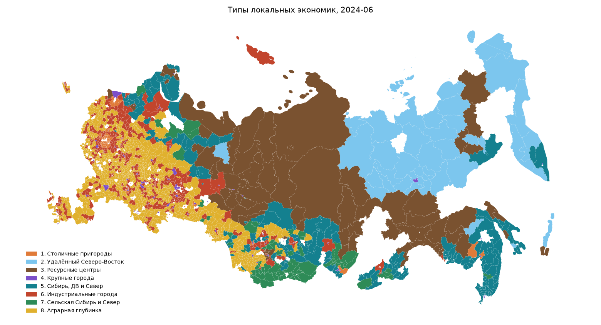
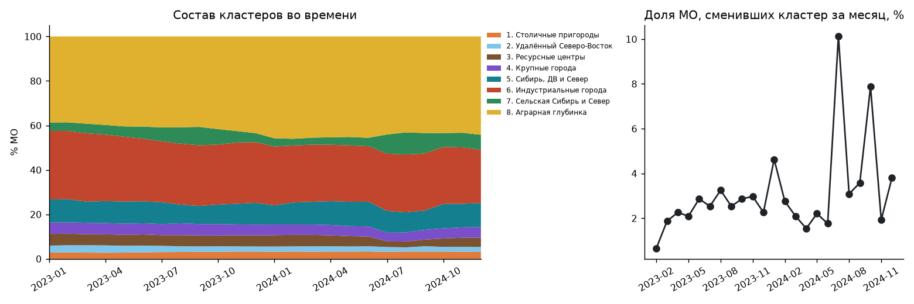

# Типы локальных экономик России: кластеризация муниципалитетов на динамической атрибутированной сети

*Методологический отчёт. Номинация «Кластеризация», онлайн-конкурс СберИндекса, 2026.*

## 1. Коротко

* **Что построено.** Динамическая атрибутированная сеть из 1815 муниципальных образований
  (МО) на 24 месяца (январь 2023 — декабрь 2024). Атрибуты МО собраны из шести блоков:
  уровень и структура безналичных трат жителя (СберИндекс), сезонность трат, отраслевая
  структура занятости и зарплаты (БДПМО Росстата), доступность рынков и население. Каждый
  месяц МО связывается с 15 экономически ближайшими МО, вес ребра задаёт гауссово ядро с
  локальным масштабом.
* **Что найдено.** 8 типов локальных экономик: столичные пригороды, удалённый
  Северо-Восток, ресурсные и вахтовые центры, крупные города, города и районы Сибири,
  Дальнего Востока и Севера, индустриальные малые и средние города, сельская периферия
  Сибири и Севера, аграрная глубинка (§7).
* **Как выбран метод.** Сравнивались 7 правил построения рёбер и 9 методов кластеризации по
  6 требуемым ICVI (SW, CH, S_Dbw, AVI, AVU, MQ), а также по стабильности во времени и
  устойчивости к подвыборке. Итоговая модель — **эволюционная спектральная кластеризация**
  (PCQ, Chi et al., 2007) на kNN-графе атрибутов. У неё лучший сводный ранг ICVI и лучшая
  временная стабильность (§5).
* **Динамика.** 71% МО ни разу не сменили тип, 91% переходов происходят между соседними
  типами. Повторяющийся сезонный сдвиг: летом «сельская Сибирь и Север» расширяется вдвое. Тренд:
  индустриальные города сжимаются (31% → 24% МО) вслед за снижением доли обрабатывающих
  производств в занятости. Доля маркетплейсов растёт во всех типах, быстрее всего на
  удалённом Северо-Востоке (+84%). Разрыв в тратах между крупными городами и периферией
  растёт (§7.3).
* **Почему этому можно доверять.** k выбрано по устойчивости на бутстрэпе. Модель не
  зависит от seed, масштаба ядра и памяти (ARI 0,93–1,00). Ядро типологии переживает
  изменение весов признаков. Типы пространственно связны, хотя соседство по дорогам в модель
  не входит (z = 43) (§8).

Материалы: код — `src/sbx`, гиперпараметры — `configs/default.yaml`, интерактивный лендинг —
https://proknulo.github.io/sberindex/landing/ (`landing/`), презентация — `docs/presentation.pptx` и
`docs/presentation.pdf`, таблицы — `results/`, соответствие критериям конкурса — `docs/criteria.md`.

---

## 2. Данные

| Источник | Что берём | Период | Покрытие |
|---|---|---|---|
| СберИндекс, `consumption.parquet` | средние безналичные траты жителя МО в месяц: продовольствие, здоровье, общепит, транспорт, маркетплейсы, все категории | 01.2023–12.2024, месяц | 2190 МО |
| СберИндекс, `market_access.parquet` | индекс доступности рынков (гравитационный потенциал населения других МО) | 2024 | 2571 МО |
| СберИндекс, `connection.parquet` | автодорожные расстояния между центрами МО | 31.12.2024 | все пары |
| СберИндекс, справочник МО | `territory_id`, ОКТМО всех версий МО, тип, регион, центр, полигоны | 2018–2024 | 3101 версия |
| Росстат, БДПМО (показатели 8423005, 8423007, 8112027) | среднесписочная численность работников по 19 разделам ОКВЭД2, среднемесячная зарплата, население на 1 января | 2021–2024, год | 99,9% МО выборки (у 90% — все показатели) |

**Ключ.** Все источники сведены к `territory_id`, то есть к МО в постоянных границах. Для
Росстата ОКТМО из БДПМО сопоставлен с ОКТМО *всех* версий МО из справочника с учётом годов
действия версии. Поэтому преобразования «район → муниципальный округ» в 2021–2024 годах не
теряют данные.

**Выборка.** В выборку входят МО, у которых траты наблюдаются не менее 18 месяцев из 24
(99,7% ячеек панели заполнены, единичные пропуски заполнены линейной интерполяцией внутри
МО). Таких МО 2058. **Внутригородские территории Москвы и Санкт-Петербурга (243 МО)
исключены из основной модели.** Во-первых, это части единого рынка труда, а не
самостоятельные локальные экономики. Во-вторых, данных БДПМО по ним нет. В первой версии
модели, где они были включены, они заняли 4 кластера из 8, и вся остальная Россия
сжалась в 4 типа. Эти территории разобраны отдельно в §7.5. Итоговая выборка — **1815 МО**.

**Ограничение данных.** В наборе СберИндекса нет Белгородской, Брянской, Курской, Воронежской,
Ростовской областей, Краснодарского края, Крыма и Севастополя, а в Дагестане, Ингушетии и
Чечне покрытие ниже 30% МО. Выводы о «карте России» относятся к территории, покрытой данными.

**Выгрузка БДПМО.** Открытого API у БДПМО нет. Скрипт `scripts/download_rosstat.py` для
каждой из 88 региональных баз воспроизводит запрос веб-формы (коды измерений берутся из JS
формы) и разбирает HTML-таблицу по её шапке. Нужно учитывать три особенности:
(1) у регионов 01–09 в ОКТМО опущен ведущий ноль; (2) сервер удаляет пустые столбцы, поэтому
столбцы определяются по шапке, а не по порядку запроса; (3) пустые ячейки означают скрытые
по требованию конфиденциальности данные, а не нули (см. §3). Автономные округа входят в базы
родительских регионов.

## 3. Пространство атрибутов

Для МО *i* в месяце *t* строится вектор x_{i,t} из 25 признаков в шести блоках.

| Блок | Признаки | Зачем |
|---|---|---|
| Уровень трат (1) | log(траты_{i,t}) − median_j log(траты_{j,t}) | благосостояние и платёжеспособный спрос; нормировка на медиану месяца убирает общую инфляцию и общероссийскую сезонность |
| Структура трат (6) | CLR-преобразование долей 6 категорий (5 + «прочее» = все − сумма пяти) | тип потребления: продуктовая экономика «первой необходимости», сервисная, «цифровая» (маркетплейсы) |
| Сезонность (2) | амплитуда внутригодовых колебаний относительного уровня; «летний пик» (июнь–август минус среднее за год) | курортные, дачные и северные территории |
| Отраслевая структура (12) | CLR долей 11 укрупнённых секторов и сектора «не раскрыто» в занятости крупных и средних организаций | предложение: чем зарабатывает территория |
| Рынок труда (2) | log(зарплата / медиана МО), работники крупных и средних организаций на жителя | производительность, роль МО как центра занятости (вахта, маятниковая миграция) |
| География и масштаб (2) | log индекса доступности рынков, log населения | положение относительно крупных рынков, агломерационный эффект |

**Почему CLR.** Доли — композиционные данные: они лежат на симплексе, и рост одной доли
механически уменьшает остальные. Евклидово расстояние между сырыми долями искажено.
Центрированное лог-отношение CLR(s)_c = log s_c − mean_c log s_c переводит симплекс в
евклидово пространство, где расстояние совпадает с расстоянием Эйчисона (Aitchison, 1986).
Используется псевдосчёт 0,005, потому что нулевые доли встречаются в малых МО.

**Сектор «не раскрыто».** Пустая ячейка БДПМО означает, что данные скрыты, так как в секторе
1–2 организации. Это *информативный* пропуск: в моногородах, ЗАТО и вахтовых МО скрыт
именно градообразующий сектор. Импутировать его «как у соседей» было бы ошибкой. В первой
версии так и было, и медианная доля добычи в районе завышалась до 8%. Поэтому остаток
«итог по МО − сумма раскрытых секторов» выделен в отдельный сектор `hidden`, и его высокая
доля сама по себе служит признаком доминирования одного работодателя. Укрупнение 19
разделов ОКВЭД2 в 11 секторов (`data.py:OKVED_GROUPS`) уменьшает число нулей в малых МО.

**Импутация.** Если данных Росстата по МО нет совсем (3% признаков), признаки
восстанавливаются kNN-импутацией (k=10, веса по расстоянию) по профилю трат и сезонности.
Используется гипотеза, что похожие по потреблению МО похожи и по структуре экономики. Доля
импутированных признаков сохраняется для каждого МО, и на лендинге такие МО помечены. Если
в текущем году данных нет, а в соседнем есть, берётся строка ближайшего года целиком, чтобы
доли и итог были согласованы.

**Масштабирование и веса.** Каждый признак винзоризуется по 1-му и 99-му перцентилям и
стандартизуется *по всей панели N·T*. Благодаря этому изменения во времени сохраняются:
признак, выросший за год, остаётся выросшим и после стандартизации. Затем блок делится на
√(число признаков) и умножается на вес из конфигурации (1 для трат и отраслей, 0,75 для
рынка труда и географии, 0,5 для сезонности, потому что она статична и описана всего двумя
признаками). Без нормировки блок из 12 секторов «перекричал» бы блок из одного признака.
Чувствительность к весам проверена в §8.

Месячные признаки трат сглажены центрированным скользящим средним за 3 месяца, чтобы
единичные всплески не вызывали ложных переходов между типами. Сезонность при этом
сохраняется: окно короче сезона.

## 4. Сеть: как появляется ребро

**Основное правило (атрибутное сходство).** Для месяца *t*:

    w_ij(t) = exp( −‖x_{i,t} − x_{j,t}‖² / (σ_i σ_j) ),   если j ∈ kNN_t(i) или i ∈ kNN_t(j),  иначе 0,

где σ_i — расстояние от *i* до 7-го соседа (самонастраивающееся ядро, Zelnik-Manor & Perona,
2004), k = 15. Сеть строится заново каждый месяц: атрибуты меняются, и вместе с ними
меняются рёбра.

Как правило влияет на структуру сети:
* **kNN вместо порога** даёт одинаковую «видимость» всем МО. При пороге по сходству плотные
  однотипные группы (сотни сельских районов) образуют почти полный подграф, а уникальные МО
  (Норильск, Магадан) становятся изолятами. kNN оставляет граф связным (одна компонента) и
  разреженным (~22 ребра на узел после симметризации).
* **Локальный масштаб σ_iσ_j** выравнивает веса в плотных и разреженных областях
  пространства признаков. Иначе веса в «хвостах» распределения стремились бы к нулю, и
  спектральный разрез отрезал бы выбросы в отдельные кластеры.
* **Симметризация объединением** (OR) сохраняет рёбра «периферийный МО → его ближайший
  тип». Пересечение (mutual kNN) оставило бы такие МО без рёбер.

### 4.1. Сравнение правил построения рёбер

Все правила реализованы в `graphs.py`. Сравнение сделано для июня 2024 года, со
спектральной кластеризацией и k = 8 (`results/edge_rules.csv`). SW, CH и S_Dbw посчитаны в
общем пространстве атрибутов, AVI, AVU и MQ — на собственном графе правила.

| Правило | Ребро | Рёбер в регионе | Медиана ребра, км | Транзит. | SW ↑ | CH ↑ | S_Dbw ↓ | AVI ↑ | MQ ↑ |
|---|---|---|---|---|---|---|---|---|---|
| **attr** | гауссово ядро по атрибутам | 22% | 722 | 0,32 | **0,118** | **270** | **0,470** | 0,774 | 0,053 |
| cosine | косинус CLR-структуры трат | 10% | 1162 | 0,41 | 0,008 | 153 | 0,640 | 0,810 | 0,069 |
| corr | корреляция рядов по 6 категориям, окно 12 мес. | 18% | 826 | 0,19 | −0,044 | 74 | 0,840 | 0,687 | 0,047 |
| lagcorr | max_{\|ℓ\|≤3} корреляции с лагом | 6% | 1669 | 0,13 | −0,071 | 25 | 0,960 | 0,571 | 0,070 |
| dtw | DTW z-рядов, полоса Сакоэ–Тибы 2 | 8% | 1447 | 0,22 | −0,071 | 33 | 0,934 | 0,684 | 0,022 |
| geo | exp(−d/150 км), 15 ближайших по дороге | 71% | 118 | 0,63 | −0,039 | 48 | 0,740 | **0,987** | **0,076** |
| hybrid | 0,7·attr + 0,3·corr | 18% | 806 | 0,19 | 0,032 | 209 | 0,567 | 0,628 | 0,040 |

Выводы:

1. **Динамические правила** (corr, lagcorr, dtw) дают кластеры с *отрицательным* силуэтом в
   пространстве атрибутов. За 24 месяца синхронность относительных трат — слабый и шумный
   сигнал: транзитивность 0,13–0,22 означает, что «соседи соседа» почти не связаны, и
   сообщества в таком графе плохо определены. Эти правила отвечают на другой вопрос («кто
   движется вместе»), а не «кто устроен одинаково». Лаговые связи несут интересную
   информацию, но она касается сезонных фаз, а не типа экономики (§7.4).
2. **Дорожная близость** даёт почти идеальные графовые индексы (AVI 0,99), потому что
   сообщества в пространственном графе — это просто куски карты: 71% рёбер лежат внутри
   региона. Это регионализация, а не типология: столичный пригород и соседний аграрный район
   попадают в один кластер.
3. **Косинус структуры трат** игнорирует уровень трат и занятость, поэтому хорошо разрезает
   собственный граф (AVI 0,81), но смешивает богатые и бедные МО (SW ≈ 0).
4. **Гибрид** уступает чистому атрибутному графу по всем атрибутным индексам: добавление
   рёбер «синхронной динамики» размывает структуру.
5. **Атрибутный граф** — лучший по SW, CH и S_Dbw при приемлемых AVI и MQ. Это ожидаемо:
   ребро здесь прямо кодирует «экономическую близость» в смысле задачи.



Разные правила дают действительно разные сети. ARI между разбиениями на разных графах
составляет 0,1–0,4 (кроме гибрида, который на 70% состоит из атрибутного графа: 0,65;
`results/edge_rules_ari_agc.csv`, разбиения AGC), поэтому выбор правила — ключевое
модельное решение, а не техническая деталь.

## 5. Методы кластеризации

| Метод | Что использует | Суть |
|---|---|---|
| K-means, Ward | только атрибуты | базовые линии без сети |
| Спектральная (Ng–Jordan–Weiss) | граф | минимальный нормированный разрез через собственные векторы L_sym = I − D^{-½}WD^{-½} |
| Leiden (Traag et al., 2019) | граф | максимизация модулярности; разрешение γ подбирается бисекцией под k |
| AGC (Zhang et al., IJCAI 2019) | атрибуты + граф | низкочастотный графовый фильтр X̄ = ((I + S)/2)^p X, S = D^{-½}(W+I)D^{-½}, p = 3, затем k-means |
| Темпоральный Leiden (Mucha et al., 2010) | графы всех месяцев | мультислойная модулярность, каждый МО связан сам с собой в соседних месяцах весом ω = 0,5 |
| Эволюционные версии K-means, AGC, спектральной | + история | §6 |

Средние по 24 месяцам на атрибутном графе, k = 8 (`results/methods.csv`). «Стабильность» —
ARI между соседними месяцами, «устойчивость» — средний ARI при бутстрэпе 80% узлов
(30 повторов).

| Метод | SW ↑ | CH ↑ | S_Dbw ↓ | AVI ↑ | AVU ↓ | MQ ↑ | Стабильность | Устойчивость | Ранг ICVI |
|---|---|---|---|---|---|---|---|---|---|
| K-means | 0,104 | **307** | 0,430 | 0,754 | 0,075 | 0,031 | 0,669 | 0,592 | 5,2 |
| Ward | 0,073 | 269 | 0,468 | 0,749 | 0,075 | 0,036 | 0,454 | 0,380 | 6,7 |
| Спектральная | 0,116 | 264 | 0,483 | 0,787 | **0,066** | **0,052** | 0,892 | **0,829** | 4,0 |
| Leiden | 0,076 | 251 | 0,425 | 0,780 | 0,074 | 0,029 | 0,644 | 0,533 | 5,7 |
| AGC | 0,102 | 300 | 0,442 | 0,775 | 0,078 | 0,037 | 0,785 | 0,762 | 5,3 |
| AGC эволюционная | 0,107 | 297 | 0,453 | 0,776 | 0,076 | 0,045 | 0,913 | 0,762 | 4,8 |
| K-means эволюционная | 0,103 | 306 | 0,453 | 0,764 | 0,074 | 0,035 | 0,906 | 0,592 | 5,0 |
| **Спектральная эволюционная** | **0,118** | 265 | 0,482 | **0,788** | **0,066** | **0,052** | **0,947** | **0,829** | **3,0** |
| Темпоральный Leiden | 0,067 | 244 | **0,422** | 0,783 | **0,066** | 0,034 | 0,834 | — | 5,3 |



Как читать таблицу:
* **Спектральные методы выигрывают по SW, AVI, AVU и MQ** и заметно устойчивее к подвыборке.
  Типы МО имеют вытянутую, нелинейную форму в пространстве признаков: например, «аграрная
  глубинка» тянется от относительно благополучных районов Поволжья до бедных районов Сибири
  непрерывным «рукавом». Спектральный разрез находит такие области по связности. K-means и
  Ward режут их на выпуклые куски, и на соседних подвыборках эти куски режутся по-разному
  (устойчивость 0,38–0,59).
* **CH и S_Dbw благоприятствуют K-means-подобным решениям.** CH — это отношение межгрупповой
  дисперсии к внутригрупповой, оно максимально для сферических кластеров. Мы не подгоняли
  выбор под один индекс, а используем средний ранг по шести ICVI и отдельно учитываем
  стабильность и устойчивость.
* **Leiden и темпоральный Leiden** хорошо делят граф (AVI), но их кластеры неоднородны по
  атрибутам (SW 0,07). Модулярность «не видит» атрибуты за пределами того, что закодировано
  в рёбрах, и разрешение γ плохо контролирует баланс размеров.
* **AGC** оказался промежуточным: фильтрация по графу стабилизирует k-means (устойчивость
  0,59 → 0,76), но не исправляет его склонность к выпуклым кластерам.

Итоговая модель — эволюционная спектральная кластеризация. По ICVI она совпадает со
статичной спектральной (SW 0,118 против 0,116), но лучше по стабильности: 0,947 против
0,892, а доля МО без переходов 71% против 57%.

**Выбор k.** Внутренние индексы почти монотонны по k: SW и CH падают, MQ растёт. Для
социально-экономических данных без «естественных» разрывов это типично (Halkidi et al.,
2001). Поэтому дополнительно используется критерий устойчивости (Ben-Hur, Elisseeff &
Guyon, 2002): средний ARI между разбиением всей выборки и разбиениями 20 подвыборок по 80%.
Правило такое: **наибольшее k с устойчивостью ≥ 0,8** (`results/k_selection.csv`,
`results/figures/k_selection.png`).

| k | SW ↑ | CH ↑ | S_Dbw ↓ | AVI ↑ | AVU ↓ | MQ ↑ | Устойчивость ↑ |
|---|---|---|---|---|---|---|---|
| 4 | 0,217 | 423 | 0,647 | 0,877 | 0,181 | 0,022 | 0,84 ± 0,08 |
| 5 | 0,176 | 413 | 0,459 | 0,866 | 0,123 | 0,035 | 0,91 ± 0,05 |
| 6 | 0,157 | 357 | 0,441 | 0,840 | 0,095 | 0,038 | 0,89 ± 0,06 |
| 7 | 0,149 | 312 | 0,471 | 0,814 | 0,080 | 0,050 | 0,90 ± 0,03 |
| **8** | 0,118 | 270 | 0,470 | 0,774 | 0,065 | 0,053 | **0,83 ± 0,06** |
| 9 | 0,091 | 256 | 0,438 | 0,773 | 0,059 | 0,056 | 0,53 ± 0,12 |
| 10 | 0,091 | 237 | 0,400 | 0,785 | 0,049 | 0,069 | 0,61 ± 0,15 |
| 11 | 0,077 | 224 | 0,389 | 0,768 | 0,045 | 0,066 | 0,55 ± 0,07 |
| 12 | 0,076 | 214 | 0,377 | 0,748 | 0,042 | 0,063 | 0,62 ± 0,10 |
| 13 | 0,076 | 203 | 0,352 | 0,741 | 0,036 | 0,072 | 0,56 ± 0,07 |
| 14 | 0,066 | 173 | 0,393 | 0,706 | 0,035 | 0,067 | 0,62 ± 0,06 |



При k ≤ 8 устойчивость 0,83–0,91, при k = 9 она обрывается до 0,53 и дальше не
восстанавливается. Дальнейшее дробление самого массового типа («аграрная глубинка»)
неустойчиво: внутри него экономическое пространство непрерывно. MQ при этом растёт до k = 8
(0,022 → 0,053), что тоже поддерживает выбор.

## 6. Отслеживание кластеров во времени

**Эволюционная спектральная кластеризация.** Используется схема PCQ (preserving cluster
quality, Chi, Song, Zhou, Hino & Tseng, KDD 2007). Разбиение месяца *t* должно хорошо
разрезать и текущую сеть, и «историю»:

    Cost_t = α · Ncut(C_t | W_t) + (1 − α) · Ncut(C_t | W̃_{t−1}),

что сводится к спектральной кластеризации сглаженной матрицы

    W̃_t = α · W_t + (1 − α) · W̃_{t−1},   W̃_0 = W_0,   α = 0,5.

Мы используем экспоненциальную память (W̃_{t−1}, а не W_{t−1}, как в исходной статье).
В варианте с одним прошлым месяцем в декабре 2024 года 85 МО «перешли» из типа 6 в тип 7,
хотя их признаки за месяц почти не изменились: спектральный разрез перестроил границу.
Экспоненциальная память (полупериод 1 месяц) убирает такие скачки. Сезонные сдвиги, которые
держатся несколько месяцев, она сохраняет. Метки согласуются с предыдущим месяцем
венгерским алгоритмом по матрице перекрытий.

Для сравнения реализована эволюционная кластеризация Chakrabarti, Kumar & Tomkins (KDD 2006)
для k-means и AGC: центры месяца *t* инициализируются центрами *t−1* и сглаживаются
c_t ← α·c_t + (1−α)·c_{t−1}.

**События** (Greene, Doyle & Cunningham, 2010). Для соседних месяцев по долям перекрытия
|A∩B|/|A| и |A∩B|/|B| ≥ 0,3 фиксируются продолжение, слияние, разделение, рождение и
исчезновение кластера (`results/final_events.csv`).

**Метрики динамики** (`results/final_temporal.json`): ARI и NMI между соседними месяцами,
ARI первого и последнего месяца, доля МО, сменивших тип за месяц, доля МО, ни разу не
сменивших тип, матрица переходов, «уверенность» МО в типе (доля месяцев в модальном типе),
доля переходов между соседними типами.

## 7. Результаты

### 7.1. Восемь типов локальных экономик

Нумерация типов идёт по убыванию медианных трат жителя. Ниже — медианы признаков по
МО-месяцам типа (`results/final_profiles.csv`) и полный z-профиль
(`results/figures/cluster_dna.png`).

| Тип | МО | Траты, ₽/мес | Продукты | Общепит | Маркетпл. | Сезонн. ампл. | Обработка | Добыча | Бюджет | Не раскр. | Зарплата к медиане | Работники/жители |
|---|---|---|---|---|---|---|---|---|---|---|---|---|
| 1. Столичные пригороды | 56 | 41 019 | 36% | 5,8% | 14,6% | 0,031 | 23% | 0% | 27% | 0% | ×1,72 | 0,19 |
| 2. Удалённый Северо-Восток | 47 | 39 199 | 46% | 3,3% | 4,5% | 0,082 | 0% | 0% | 47% | 9% | ×2,14 | 0,35 |
| 3. Ресурсные центры | 82 | 38 283 | 41% | 4,3% | 11,5% | 0,043 | 3% | 21% | 21% | 4% | ×2,31 | 0,54 |
| 4. Крупные города | 87 | 33 968 | 38% | 5,8% | 11,7% | 0,027 | 20% | 0% | 37% | 0% | ×1,37 | 0,26 |
| 5. Сибирь, ДВ и Север | 178 | 28 331 | 46% | 2,3% | 11,4% | 0,030 | 0% | 0% | 46% | 7% | ×1,33 | 0,22 |
| 6. Индустриальные города | 491 | 26 191 | 44% | 3,2% | 14,1% | 0,027 | 18% | 0% | 38% | 2% | ×1,08 | 0,19 |
| 7. Сельская Сибирь и Север | 100 | 23 628 | 46% | 2,0% | 14,1% | 0,036 | 0% | 0% | 67% | 8% | ×1,04 | 0,16 |
| 8. Аграрная глубинка | 773 | 20 318 | 48% | 1,5% | 15,5% | 0,032 | 0% | 0% | 55% | 10% | ×0,84 | 0,14 |



**1. Пригороды столичных агломераций** (≈56 МО; Подмосковье — 40, Ленинградская обл. — 6;
Балашиха, Одинцово, Люберцы, Всеволожский р-н). Самые высокие траты жителя и максимальная
доступность рынков. В занятости выделяются торговля (14%, z = +2,8), обработка и рыночные
услуги: склады, промпарки, B2B. На продукты уходит всего 36% трат, на общепит 5,8%.
Экономика обслуживания мегаполиса. Вместе с аграрной глубинкой это самый стабильный тип: в среднем 0,3 смены за два года.

**2. Удалённый Северо-Восток** (≈47 МО: 27 якутских улусов, Камчатка, Колыма, Курилы,
Чукотка). Высокие траты и зарплаты (северные надбавки), но маркетплейсы — лишь 4,5% трат
при типичных 12–15%. Это прямое следствие логистической изоляции, минимальной доступности
рынков (z = −2,4). Здесь самая сильная сезонность трат (амплитуда 0,08 против 0,03) с
летним пиком +8%: навигация, северный завоз, отпуска. Показательный отрицательный пример
для маркетплейсов: их доля всё же почти удвоилась за два года (3,6% → 6,5%).

**3. Ресурсные и вахтовые центры** (≈82 МО: Норильск, Югра — 14, Ямал — 12, Мурманская обл.
— 8, Коми, Мирнинский и Нерюнгринский районы). Добыча — около 21% занятости, выделяется
строительство (9%). Самые высокие относительные зарплаты (×2,3 к медианному МО). Число
работников крупных и средних организаций равно 53% населения, в 2,5 раза больше типичного:
это вахта и приезжие работники, которых нет в постоянном населении.

**4. Крупные города и региональные центры** (≈87 МО: миллионники и региональные столицы).
Максимальное население, наибольшие доли рыночных услуг (IT, финансы, B2B) и обработки.
Повышенная доля общепита и здоровья в тратах: сервисная экономика. Самый устойчивый к
весам признаков тип (Жаккар 0,83, §8).

**5. Города и районы Сибири, Дальнего Востока и Севера** (≈178 МО: Приморье — 29, Красноярский
край — 23, Забайкалье — 18, Приангарье — 16; Артём, Междуреченск, Биробиджан, Усть-Илимск).
Около девятой части типа (19 МО) — Европейский Север: Карелия — 7, Архангельская обл. — 4,
Коми и Мурманская обл. — по 3, Вологодская обл. — 2. По экономике они ближе к сибирским и дальневосточным МО, чем к
своим соседям, поэтому название типа включает Север. Зарплаты выше медианы (районные
коэффициенты и северные надбавки), выделяется транспорт и логистика в занятости,
доступность рынков низкая. Это *промежуточный* тип: через него проходит больше всего
переходов — из ресурсных центров, из сельской Сибири и Севера и обратно.

**6. Индустриальные малые и средние города** (≈491 МО: Урал, Поволжье, Предкавказье; Орск,
Сызрань, Нефтекамск, Зеленодольск, Нальчик). Обработка — около 18% занятости, средний
уровень трат, хорошая доступность рынков. Тип сокращается (§7.3).

**7. Сельская периферия Сибири и Севера** (≈100 МО: Приангарье, Тыва, Алтай, Новосибирская обл.,
Красноярский край; 12 районов Коми, Карелии и Архангельской обл.). Бюджетный сектор даёт две трети занятости крупных и средних организаций,
это максимум среди типов. Повышенная доля транспорта в тратах (расстояния, топливо), летний
пик трат (дачный и туристический сезон: Алтай, Байкал, Хакасия).

**8. Аграрная глубинка** (≈773 МО, 43% выборки: Алтайский край — 53, Кировская — 35,
Башкортостан — 34, Саратовская — 32). Минимальные траты (20 тыс. ₽ в месяц на жителя),
наибольшая доля продуктов (48%). Доля маркетплейсов тоже наибольшая (12,7% → 17,9%):
маркетплейс здесь заменяет отсутствующую розницу. В занятости сельское хозяйство и бюджетный
сектор, зарплаты ниже медианы.



Карта (`results/figures/map_clusters.png`) показывает, что типы складываются в осмысленные
макрорегионы: «ресурсный» пояс Севера, «северо-восточный» массив Якутии и Колымы,
«сибирско-дальневосточный» юг Сибири. При этом ни координаты, ни соседство в модель не
входят (§8).

### 7.2. Экономическая осмысленность

* **Спрос и предложение согласованы.** Типы, выделенные по совокупности признаков, одинаково
  упорядочены по тратам (СберИндекс) и по зарплатам (Росстат), кроме ресурсного и
  северо-восточного типов. Там высокие зарплаты сочетаются с «продуктовой» структурой трат:
  высокая стоимость жизни.
* **Структура трат отражает инфраструктуру.** Доля общепита в 4 раза выше в пригородах и
  крупных городах (5,8–5,9%), чем в аграрной глубинке (1,5%). Доля маркетплейсов максимальна
  там, где мало офлайн-розницы (аграрная глубинка), и минимальна там, куда не доходит
  доставка (Северо-Восток).
* **Сектор «не раскрыто»** максимален в аграрной глубинке, на Северо-Востоке и в сельской
  Сибири и Севере (8–10% занятости): там в секторе часто один работодатель, и Росстат скрывает данные.

### 7.3. Динамика

| Показатель | Значение |
|---|---|
| ARI между соседними месяцами | 0,947 |
| ARI январь 2023 ↔ декабрь 2024 | 0,669 |
| Средняя доля МО, сменивших тип за месяц | 3,1% |
| МО, ни разу не сменившие тип | 70,6% |
| Переходы между двумя ближайшими по центроидам типами | 91% |



**Что меняется.**

1. **Сезонная пульсация «сельской Сибири и Севера».** Тип 7 растёт каждое лето: в 2023 году с 3,8% МО
   до 8,3% в сентябре, в 2024 году с 3,8% до 9,9% в августе. Осенью он сжимается обратно.
   Приходят соседние районы из типов 5 и 8 с летним пиком трат (дачи, туризм). Эффект
   повторяется оба года, но для отдельных МО переходы плохо отличимы от граничного шума:
   изменения признаков у перешедших и оставшихся МО сопоставимы. Поэтому это скорее
   «сезонное смещение границы типа», чем трансформация отдельных экономик.
2. **Сокращение индустриального типа.** Доля типа 6 снизилась с 30,8% до 23,9% МО, и 116 МО
   перешли за два года в аграрную глубинку (Башкортостан, Татарстан, Кировская, Челябинская
   области). У них доля обрабатывающих производств в занятости упала с 11,7% до 7,3% (БДПМО,
   2023 → 2024), а доля маркетплейсов в тратах выросла. Сдвиг приходится на смену года в
   данных Росстата. Он может отражать и реальное сокращение промышленной занятости, и
   изменения учёта (перерегистрацию организаций); различить это на двух годах нельзя.
3. **Летний сдвиг ресурсных центров (2024).** В июле 2024 года 39 ресурсных МО (Югра, Амурская
   обл.) временно перешли в тип 5 и вернулись в октябре. В 2023 году такого почти не было,
   поэтому это наблюдение, а не установленный эффект.

**Что меняется внутри типов** (`results/final_type_trajectories.csv`):
* **Маркетплейсы — главный драйвер изменения структуры трат.** Их доля выросла на 34–45% в
  большинстве типов. Быстрее всего на удалённом Северо-Востоке (+84%, 3,6% → 6,5%), медленнее
  всего в столичных пригородах (+21%). Доля продуктов снизилась на 2–4%.
* **Разрыв растёт.** Средние за год траты жителя в крупных городах выросли на 18,0%, в
  пригородах на 16,5%, а на Северо-Востоке на 11,4%, в аграрной глубинке на 13,3%. Стандартное отклонение
  относительного уровня трат между МО не снижается (0,26 → 0,26): σ-конвергенции нет.

### 7.4. Лаговые связи: кто опережает

Для каждой пары МО найден лаг ℓ ∈ [−3, 3] мес., максимизирующий корреляцию рядов
относительных трат. Среди сильных пар (r > 0,7) у 56% оптимальный лаг ненулевой. Если
агрегировать по типам (`results/final_leadlag.csv`), Северо-Восток «опережает» в 75% таких
пар, сельская Сибирь и Север — в 63%, а индустриальные города и столичные пригороды чаще «следуют»
(37–39%). Это сдвиг сезонных фаз: пик трат на Севере наступает раньше (навигация, отпуска).
Для раннего обнаружения сезонных и шоковых сигналов это полезно, но как правило построения
рёбер для типологии лаговая корреляция непригодна (§4.1).

### 7.5. Внутригородская структура Москвы и Санкт-Петербурга

243 внутригородские территории не входят в основную модель (§2), но разобраны той же схемой:
kNN-граф с самонастраивающимся ядром (10 соседей вместо 15: выборка меньше), эволюционная спектральная кластеризация с памятью и
правило устойчивости для выбора k. Признаки при этом только из блоков трат: уровень, структура и
сезонность, потому что данных Росстата по районам нет (`python -m sbx.intracity`,
`results/intracity_*.csv`). Правило дало k = 5 (устойчивость 0,83; при k = 6 она падает до 0,64).

| Тип | Районов (Москва / Петербург) | Траты, ₽/мес | Продукты | Общепит | Маркетплейсы |
|---|---|---|---|---|---|
| 1. Престижный центр и запад Москвы | 35 (33 / 2) | 59 310 | 28% | 9,0% | 10,7% |
| 2. Обеспеченные срединные районы | 66 (32 / 34) | 48 709 | 31% | 8,5% | 11,4% |
| 3. Спальные районы Москвы | 60 (52 / 8) | 46 767 | 33% | 7,3% | 12,9% |
| 4. Городские районы Петербурга | 43 (3 / 40) | 41 894 | 34% | 7,7% | 11,9% |
| 5. Периферия столиц | 39 (24 / 15) | 40 850 | 35% | 6,3% | 14,4% |

Типы выстраиваются в градиент от престижного центра и запада Москвы (Арбат, Хамовники,
Раменки, Крылатское) через срединное кольцо Москвы и исторический центр Петербурга, спальные
районы и внутренние районы Петербурга к периферии: Новой Москве, промзонам и пригородным городам
Петербурга (Колпино, Кронштадт, Петергоф). Москва и Петербург смешиваются внутри типов, и это
главный вывод: внутригородское различие определяется положением района (центр, срединное кольцо,
спальный район, периферия), а не городом. Медианные траты типов различаются в полтора раза
(от 41 до 59 тыс. ₽), а у отдельных районов центра доходят почти до 90 тыс. ₽ (Хамовники).

На лендинге районы показаны на карте отдельным слоем в оттенках винного (кнопка «Москва и
Петербург»): портрет пяти типов, карточка каждого района с типом по месяцам и структурой трат
против медианы типа, поиск по районам, выгрузка в CSV. Типы районов по месяцам —
`results/intracity_labels.csv`.

### 7.6. Как это использовать

* **Бенчмаркинг «двойников».** Для каждого МО на лендинге показаны 5 самых похожих МО *из
  других регионов*. Для муниципальной политики это готовый список для сравнения показателей
  и переноса практик: сравнивать район с его экономическим двойником корректнее, чем с
  соседом по региону.
* **Дифференцированная политика.** Типы задают разные приоритеты: логистика и доставка для
  Северо-Востока (минимум маркетплейсов при высоких доходах), диверсификация для ресурсных и
  «скрытых» моноэкономик, поддержка индустриальных городов, теряющих промышленную занятость.
* **Мониторинг.** Переход МО в «соседний вниз» тип (индустриальный → аграрный) — ранний
  сигнал структурного сдвига, который виден по месячным данным СберИндекса раньше, чем в
  годовой статистике.

## 8. Почему этому можно доверять

**Выбор k не произвольный.** Использован явный критерий устойчивости, а не визуальный
«локоть» (§5).

**Устойчивость к модельным решениям** (`python -m sbx.robustness`,
`results/robustness_sensitivity.csv`):

| Изменение | ARI с базовой моделью (июнь 2024) |
|---|---|
| seed (1, 7) | 1,00 |
| σ по 4-му / 10-му соседу | 0,99 / 1,00 |
| память α = 0,6 / 1,0 (без памяти) | 0,99 / 0,94 |
| k в kNN = 10 / 20 | 0,94 / 0,90 |
| веса блоков ×0,5, ×1,5, исключение блока (18 вариантов) | 0,44–0,91, медиана 0,68 |

Гиперпараметры графа и модели на результат практически не влияют. Веса блоков влияют
умеренно: они определяют, *что считать сходством*. Если исключить сезонность, размываются
Северо-Восток (Жаккар 0,43) и тип «Сибирь, ДВ и Север» (0,30). Если исключить отраслевой блок,
размываются ресурсные центры (0,52) и сельская Сибирь и Север (0,27). Чтобы понять, *какие* типы переживают изменение
весов, для каждого базового типа найдено лучшее совпадение (Жаккар) среди типов варианта,
медиана по 18 вариантам:

| Тип | 1 Пригороды | 2 Северо-Восток | 3 Ресурсные | 4 Крупные города | 5 Сибирь, ДВ и Север | 6 Индустр. | 7 Сельская Сибирь и Север | 8 Аграрная |
|---|---|---|---|---|---|---|---|---|
| Жаккар | 0,87 | 0,70 | 0,68 | 0,83 | 0,51 | 0,79 | 0,33 | 0,81 |

Ядро типологии (пригороды, крупные города, индустриальные, аграрные, Северо-Восток,
ресурсные центры) воспроизводится при любых разумных весах. Переходные типы 5 и 7
чувствительны к весам: их границы — модельное решение, и мы описываем их как переходные.

**Зачем нужен каждый блок признаков.** 25 признаков — это шесть характеристик экономики: доли трат и
доли занятости — части одного целого, и в расстоянии каждый блок весит как один признак (нормировка
на √(число признаков)). Чтобы проверить, что каждый блок нужен, мы исключали его целиком и сравнивали
разбиение с итоговым. В таблице — ARI с базовой моделью (июнь 2024) и коэффициент Жаккара для типов,
которые без блока размываются сильнее всего (меньше 0,5 — тип не воспроизводится, 0,5–0,6 —
воспроизводится лишь наполовину).

| Исключённый блок | ARI | Какие типы размываются сильнее всего (Жаккар) |
|---|---|---|
| Сезонность | 0,44 | Сибирь, ДВ и Север (0,30), сельская Сибирь и Север (0,31), Северо-Восток (0,43), индустриальные (0,45) |
| Структура трат | 0,57 | сельская Сибирь и Север (0,22), аграрная глубинка (0,59) |
| География | 0,57 | Сибирь, ДВ и Север (0,20), сельская Сибирь и Север (0,34), ресурсные центры (0,36), крупные города (0,38) |
| Отрасли | 0,63 | сельская Сибирь и Север (0,27), Сибирь, ДВ и Север (0,50), ресурсные центры (0,52) |
| Уровень трат | 0,69 | сельская Сибирь и Север (0,52) |
| Рынок труда | 0,87 | заметно не меняется ничего |

Каждый блок, кроме рынка труда, держит какие-то типы: без сезонности распадается Северо-Восток,
без географии крупные города сливаются с остальными, без отраслей заметно размываются ресурсные
центры (их отличает добыча). Блок рынка труда почти не влияет на разбиение; мы оставили его для интерпретации
(относительная зарплата ресурсных центров ×2,3 — понятный экономический факт) и прямо отмечаем это.

**Внешняя (независимая) проверка — пространственная связность.** Координат и соседства в
модели нет: география входит только через индекс доступности рынков. Тем не менее у 53,3%
пар «соседей по дороге» (5 ближайших МО по автодорожному расстоянию) тип совпадает. При
случайной перестановке меток (1000 повторов) таких пар 28,9% ± 0,6%, z = 43, p < 0,001.
Типы отражают реальные экономико-географические образования.

**Согласованность с внешними фактами.** Типы совпадают с общеизвестными экономическими
районами, которые модель «не знала»: нефтегазовые Югра и Ямал, алмазная и угольная Якутия,
никелевый Норильск, Подмосковье, аграрный Алтайский край.

**Проверка индексов.** Реализации AVI, AVU, MQ и S_Dbw проверены тестами на графах с
известным ответом (`tests/test_validity.py`). Там же зафиксировано свойство AVU: при k = 2
Unifiability по определению равна 1 для любого разбиения.

## 9. Ограничения

* Два года данных: сезонность оценивается по двум циклам, тренды — по двум годовым точкам
  Росстата.
* Отраслевая структура описывает только крупные и средние организации (БДПМО, без МСП).
  Для сельских МО это смещает структуру в сторону бюджетного сектора.
* Траты — средние безналичные траты жителя по оценке моделей СберИндекса. Доля наличных
  выше в сельских и удалённых МО, поэтому разрыв в уровне трат там может быть завышен.
* 8 регионов отсутствуют в данных, внутригородские территории столиц вынесены в отдельный
  анализ.
* Индексы AVI, AVU и MQ в литературе описаны для невзвешенных графов. Мы используем их
  естественное взвешенное обобщение (суммы весов вместо числа рёбер).

## 10. Воспроизводимость

Весь проект запускается одной командой одинаково в Windows, macOS и Linux (`run.py`; для macOS и
Linux есть и `Makefile`-обёртка):

```
python run.py setup       # окружение .venv и зависимости
python run.py all         # данные → пайплайн → проверки → внутригородской анализ → рисунки → лендинг → тесты
python run.py serve       # лендинг на http://localhost:8000
```

Все гиперпараметры собраны в `configs/default.yaml`, интерпретация типов и тексты — в
`configs/cluster_names.yaml`. Случайность зафиксирована через `seed`. Спектральная
кластеризация использует детерминированное назначение меток `cluster_qr`, поэтому результат
не зависит от seed (§8). Выбор соседей в kNN-графах сделан устойчивой сортировкой, чтобы при равных
расстояниях граф не зависел от платформы и версии NumPy. Мы проверили воспроизводимость прогоном
с нуля в Windows 11: метки всех 1815 МО во всех 24 месяцах, таблицы методов, выбора k, профилей,
событий и устойчивости совпали с исходными. Файлы читаются и пишутся в UTF-8 явно, поэтому
кодировка системы на результат не влияет.

## 11. Визуализация: интерактивный лендинг и презентация

Результаты представлены интерактивным лендингом (https://proknulo.github.io/sberindex/landing/,
код — `landing/`) и презентацией (`docs/presentation.pptx`, `docs/presentation.pdf`). Лендинг
построен так, чтобы экономическую интерпретацию можно было «потрогать»:

* **Карта на векторной подложке OpenStreetMap.** Полигоны МО лежат под подписями подложки: при
  приближении проявляются города, сёла, реки и дороги, за пределами России — фон. Слои: тип, траты,
  доля маркетплейсов, число смен типа; классы слоя можно оставлять на карте по одному.
* **Фишки типов и анимация переходов.** У каждого типа своя фишка, цвет которой следует смыслу
  пиктограммы (колос — пшеничный, снежинка — ледяной, нефтяная вышка — цвет сырой нефти). При
  проигрывании 24 месяцев у МО, сменившего тип, старая фишка рушится и строится новая.
* **Портрет типа и карточка МО** с историей типа по месяцам, сравнением структуры трат и занятости с
  медианой типа и пятью экономическими двойниками из других регионов.
* **Районы Москвы и Петербурга** отдельным слоем карты: пять внутригородских типов (§7.5), портрет
  типов, карточки районов, поиск и выгрузка в CSV.
* **Игра «Угадайте экономику»** — проверка типологии «на человеке»: тип настоящего МО нужно определить
  по структуре трат, затем занятости и региону.
* **Истории изменений** (сжатие индустриального типа, сезонность сельской Сибири и Севера, рост маркетплейсов,
  потоки между типами) с переходом из графика к нужному месяцу и типу на карте.
* **Сеть экономической близости в виде паутины**: сектор — тип, у края — ядро типа, ближе к центру —
  переходные МО; приближение с уровнем детализации (чем ближе, тем больше МО и подписей).
* **Методы**: сравнение правил рёбер, методов и выбора k по шести ICVI с пояснениями индексов,
  исключение блоков признаков, профили типов; скачивание типов всех МО по месяцам в CSV.

## Литература

* Aitchison J. (1986). *The Statistical Analysis of Compositional Data.*
* Ben-Hur A., Elisseeff A., Guyon I. (2002). A stability based method for discovering structure in clustered data. *PSB.*
* Biswas A. et al. Isolability and unifiability measures for graph clustering (AVI, AVU, ANUI); см. также Howie et al. (2023), *PVLDB* 16(11).
* Chakrabarti D., Kumar R., Tomkins A. (2006). Evolutionary clustering. *KDD.*
* Chi Y., Song X., Zhou D., Hino K., Tseng B. (2007). Evolutionary spectral clustering by incorporating temporal smoothness. *KDD.*
* Greene D., Doyle D., Cunningham P. (2010). Tracking the evolution of communities in dynamic social networks. *ASONAM.*
* Halkidi M., Vazirgiannis M. (2001). Clustering validity assessment: finding the optimal partitioning of a data set (S_Dbw). *ICDM.*
* Mancoridis S. et al. (1998). Using automatic clustering to produce high-level system organizations of source code (MQ). *IWPC.*
* Mucha P. et al. (2010). Community structure in time-dependent, multiscale, and multiplex networks. *Science.*
* Ng A., Jordan M., Weiss Y. (2002). On spectral clustering: analysis and an algorithm. *NIPS.*
* Traag V., Waltman L., van Eck N. (2019). From Louvain to Leiden. *Scientific Reports.*
* Zelnik-Manor L., Perona P. (2004). Self-tuning spectral clustering. *NIPS.*
* Zhang X. et al. (2019). Attributed graph clustering via adaptive graph convolution (AGC). *IJCAI.*
